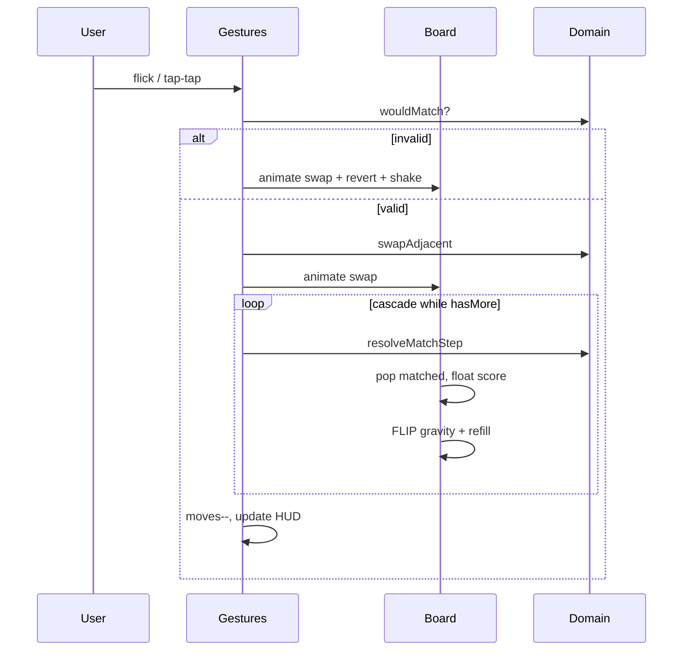

# Match-3: свайп и анимации (дизайн)

Дата: 2026-08-28  
Статус: согласован  
Область: Mini App, игра «Три в ряд» (`miniapp/src/match3.ts`)

## Цель

Улучшить UX игры: свайп-жест (flick) вместе с тап-тап, сочные анимации свапа, матчей, падения и каскадов. Доменная логика и API очков не меняются.

## Решения пользователя

| Вопрос | Выбор |
|---|---|
| Жест | Flick + тап-тап (оба) |
| Анимации | Сочные: свап, исчезновение, падение, вспышка, +очки, лёгкий shake |
| Подход | FLIP + CSS transitions, без новых зависимостей |

## Вне объёма

- Новые типы фишек, power-ups, звук
- Изменение правил (15 ходов, потолок очков, визит)
- Canvas/WebGL или библиотеки анимаций
- Haptic feedback (Telegram HapticFeedback — опционально позже)

## Архитектура

### Разделение слоёв

```
match3.ts           — оркестратор: состояние партии, ходы, finishGame
match3-board.ts     — DOM-доска: создание/обновление плиток, FLIP-анимации
match3-gestures.ts  — flick (pointer events) + tap-тап, блокировка ввода
match3.css          — стили + keyframes (pop, shake, score-float)
src/domain/match3.ts — + resolveMatchStep для пошаговых каскадов
```

Домен остаётся источником истины для логики. UI только анимирует шаги, которые домен возвращает.

### Пошаговое разрешение матчей

Сейчас `resolveMatches` схлопывает все каскады за один вызов. Для анимаций добавляется:

```typescript
resolveMatchStep(
  board: Board,
  cascadeIndex: number,
  random?: RandomFn,
): {
  next: Board;
  scoreDelta: number;
  matchedCells: ReadonlyArray<{ row: number; col: number }>;
  hasMore: boolean;
}
```

- Один вызов = один каскад: найти группы → начислить очки (`SCORE_PER_TILE × cells × cascadeIndex`) → очистить → гравитация → refill.
- `hasMore === true`, если на новой доске снова есть группы.
- `resolveMatches` переписывается как цикл над `resolveMatchStep` (поведение и тесты сохраняются).

## Жесты и ввод

### Flick

- `pointerdown` на плитке → запомнить стартовую клетку и координаты.
- `pointermove` / `pointerup`: если смещение > 30% размера клетки **или** скорость достаточна — определить направление (↑↓←→), вычислить соседа.
- Невалидный свайп (диагональ, слишком короткий) — игнор.
- Валидный сосед → тот же pipeline, что и тап-тап.

### Тап-тап

- Без изменений по логике: первый тап — `selected`, второй на соседа — попытка свапа.
- Повторный тап на ту же — снять выделение.

### Невалидный свап

- Если `wouldMatch === false`: анимация «пробного» свапа (150 ms) → откат (150 ms) + класс `shake` на доске.
- Ход **не** тратится, очки не меняются.

### Блокировка

- Флаг `busy` на время: свап → каскады → обновление счёта.
- Пока `busy`, pointer/click игнорируются.

## Анимации (сочные)

| Этап | Длительность | Эффект |
|---|---|---|
| Свап | 180 ms | `transform: translate()` обеих плиток, `ease-out` |
| Откат | 150 ms × 2 | обратный translate + `shake` на `.match3-board` |
| Матч | 220 ms | matched tiles: `scale(1.2)` + `opacity: 0`, класс `popping` |
| +Очки | 600 ms | floating `+N` над центром матча, `translateY(-24px)` + fade |
| Падение | 260 ms | FLIP: записать old rect → обновить DOM → `transform` from delta → animate to 0 |
| Новые сверху | 260 ms | spawn с `translateY(-100%)` → 0 |
| Каскад shake | 120 ms | лёгкий `translateX(±2px)` на доске между каскадами |
| Счёт партии | 400 ms | при изменении очков — `match3-score-bump` на счётчике |

`prefers-reduced-motion: reduce` — все transition/animation → 0 ms или `opacity` only.

## UX-улучшения

- Подсказка под заголовком: «Свайпните или нажмите две соседние фишки».
- `:active` на плитке — `scale(0.92)`.
- Выделение — outline + лёгкий glow (как сейчас, через `.selected`).
- Экран окончания: счёт «набегает» (count-up 400 ms) перед отправкой на сервер.
- `touch-action: none` на доске — без скролла Telegram при свайпе.

## Поток одного хода



## Ошибки

- Анимация прервана (быстрый unmount) — без side effects, `busy` сбрасывается в `finally`.
- `submitGameScore` error — показать как сейчас, без повторной отправки.

## Тестирование

**Домен (vitest):**
- `resolveMatchStep` — один каскад, `hasMore`, сумма шагов = `resolveMatches`.
- Регрессия существующих тестов `match3.test.ts`.

**UI (ручная):**
- Flick во все 4 стороны на телефоне в Telegram.
- Тап-тап на десктопе.
- Невалидный свап — откат, ход не тратится.
- Каскад 2+ уровней — анимации идут последовательно.
- 15-й ход → finish screen.
- `prefers-reduced-motion` в DevTools.

## Файлы

| Файл | Действие |
|---|---|
| `src/domain/match3.ts` | добавить `resolveMatchStep`, рефактор `resolveMatches` |
| `tests/domain/match3.test.ts` | тесты step + equivalence |
| `miniapp/src/match3.ts` | оркестратор, без innerHTML на каждый кадр |
| `miniapp/src/match3-board.ts` | **новый** — DOM + анимации |
| `miniapp/src/match3-gestures.ts` | **новый** — flick + tap |
| `miniapp/src/match3.css` | keyframes, reduced-motion, touch-action |
