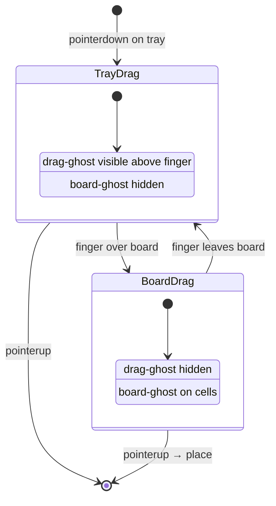

# Block Blast: drag UX — фигура над пальцем (дизайн)

Дата: 2026-08-31  
Статус: согласован, ждёт реализации  
Область: Mini App, игра «Блоки» (`miniapp/src/block-blast*.ts`)  
Родительская спека: `2026-08-31-ui-ux-improvements-design.md` (UI-1 blocker)

## Цель

Исправить неудобный drag: при перетаскивании фигуры из tray она оказывается **под пальцем**, перекрывая обзор поля. Фигура должна быть **над точкой касания**, preview на доске — точным. Доменная логика (`src/domain/block-blast.ts`) и API очков не меняются.

## Проблема

Текущая реализация в `block-blast-gestures.ts`:

```ts
const DRAG_OFFSET_Y = 80;

const positionDragGhost = (ghost, clientX, clientY) => {
  ghost.style.left = `${clientX}px`;
  ghost.style.top = `${clientY - DRAG_OFFSET_Y}px`;
};
```

CSS в `block-blast.css`:

```css
.bb-drag-ghost {
  position: fixed;
  transform: translate(-50%, -50%);  /* центр ghost = точка позиционирования */
}
```

**Почему не работает:**

1. Фиксированный offset 80px недостаточен на большинстве телефонов (большой палец ~15–20mm ≈ 50–70px + высота фигуры).
2. Якорь — geometric center ghost, а не **низ фигуры** над пальцем (стандарт Block Blast / Blockudoku).
3. Одновременно видны drag-ghost под пальцем и board-ghost на поле — визуальный шум.
4. `boardCellFromPoint(clientX, clientY)` использует raw координаты пальца, не компенсируя offset preview.

## Решение

### A. Якорь ghost — низ по центру

```css
.bb-drag-ghost {
  position: fixed;
  z-index: 100;
  pointer-events: none;
  transform: translate(-50%, -100%); /* нижний край = anchor point */
  opacity: 0.92;
  filter: drop-shadow(0 4px 12px rgba(0, 0, 0, 0.5));
}
```

Позиционирование:

```ts
const positionDragGhost = (ghost: HTMLElement, clientX: number, clientY: number, piece: Piece) => {
  const { rows } = pieceBounds(piece);
  const pieceHeightPx = rows * cellSizeForGhost + (rows - 1) * TRAY_PIECE_GAP_PX;
  const offsetY = Math.max(120, pieceHeightPx + 48);
  ghost.style.left = `${clientX}px`;
  ghost.style.top = `${clientY - offsetY}px`;
};
```

`cellSizeForGhost` — размер клетки в drag preview (72px max из `createDragGhostElement`).

### B. Два режима отображения



| Зона пальца | drag-ghost | board-ghost |
|---|---|---|
| Над tray | visible, над пальцем | hidden |
| Над board | **hidden** | visible на клетках |
| Вне обеих | visible или hidden | hidden |

При pointer over board — **скрыть** `.bb-drag-ghost`, показывать только `boardApi.setGhost()`. Это стандарт UX для block-puzzle игр.

### C. Hit-testing с компенсацией

Когда drag-ghost скрыт и показан board-ghost, placement использует **anchor cell** preview, а не raw `clientY`:

```ts
const boardCellFromPoint = (clientX: number, clientY: number, piece: Piece) => {
  // Option 1: offset finger up by same offsetY when over board
  const compensatedY = isOverBoard(clientX, clientY)
    ? clientY - computeOffsetY(piece)
    : clientY;
  return boardApi.boardCellFromPoint(clientX, compensatedY);
};
```

**Option 2 (предпочтительно):** вычислять row/col из **позиции board-ghost anchor** (top-left cell of piece), а не из finger — ghost уже на правильных клетках.

Acceptance: preview и финальное placement **совпадают** (нет смещения на 1 клетку).

### D. Tray feedback

- `touch-action: none` на `.bb-tray` (предотвратить scroll во время drag)
- Слот источника: `opacity: 0.35` пока идёт drag (`bb-tray-slot--dragging`)
- `pointerdown` → `setPointerCapture` на slot для стабильного tracking

### E. Haptic

| Событие | Impact |
|---|---|
| pickup (drag threshold passed) | light |
| valid drop | medium |
| invalid drop | notification error |

Через существующий `hapticImpact` из `telegram.ts`.

## Изменения по файлам

| Файл | Изменения |
|---|---|
| `block-blast-gestures.ts` | dynamic offset, board/tray zones, compensated hit-test, haptic |
| `block-blast-board.ts` | export `pieceBounds` или shared util; slot dragging class |
| `block-blast.css` | ghost transform `-100%`, tray dragging, `touch-action: none` |

## Константы

```ts
const DRAG_THRESHOLD_PX = 8;           // без изменений
const MIN_FINGER_OFFSET_PX = 120;        // было DRAG_OFFSET_Y = 80
const FINGER_MARGIN_PX = 48;             // зазор между пальцем и низом фигуры
```

## Вне объёма

- Изменение правил игры, tray generation, scoring
- GameSkin tiles (отдельная спека UI-2)
- Canvas renderer вместо DOM

## Acceptance criteria

- [ ] При drag над tray фигура **полностью видна выше** точки касания на iPhone SE и Pro Max
- [ ] При drag над board виден только **preview на клетках**, палец не перекрывает целевые клетки
- [ ] Placement совпадает с preview (0 смещения)
- [ ] Tap-to-place (без drag) работает как раньше
- [ ] `prefers-reduced-motion: reduce` — offset корректный, анимации placement/clear без изменений
- [ ] Нет регрессии: combo, game over, score submit

## Проверки

**Ручная (обязательно):**

1. iPhone / Android Telegram: drag L-фигуры в угол 8×8
2. Быстрый flick tray → board → отпуск
3. Invalid drop → shake tray piece
4. Tap select + tap board (без drag)

**Авто (если feasible):**

- Unit: `computeOffsetY(piece)` для 1×1, 3×3, L-shape
- Unit: `boardCellFromPoint` с compensated Y даёт тот же cell, что ghost anchor

## Порядок реализации

1. CSS: `transform: translate(-50%, -100%)`
2. Dynamic offset в `positionDragGhost`
3. Zone logic: hide drag-ghost over board
4. Hit-test compensation
5. Tray dragging state + touch-action
6. Haptic hooks
7. Manual QA на 2 устройствах
