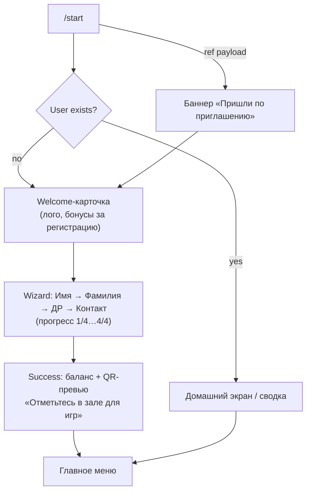
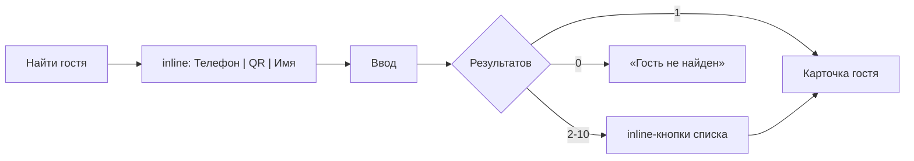
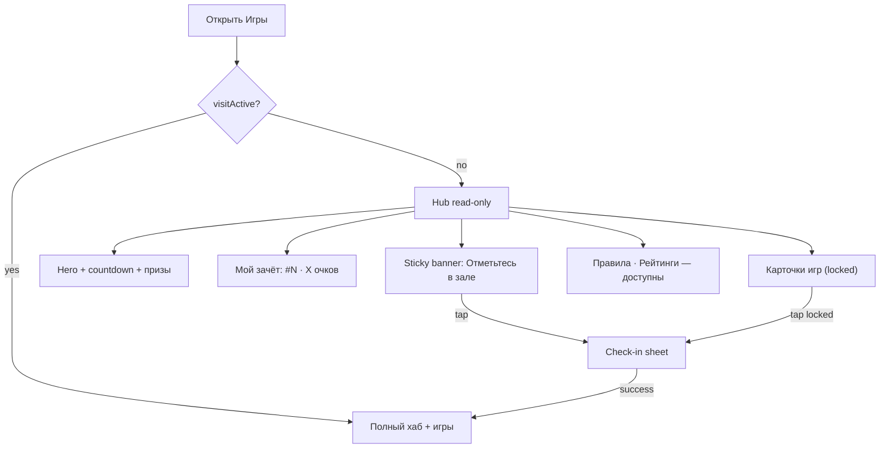
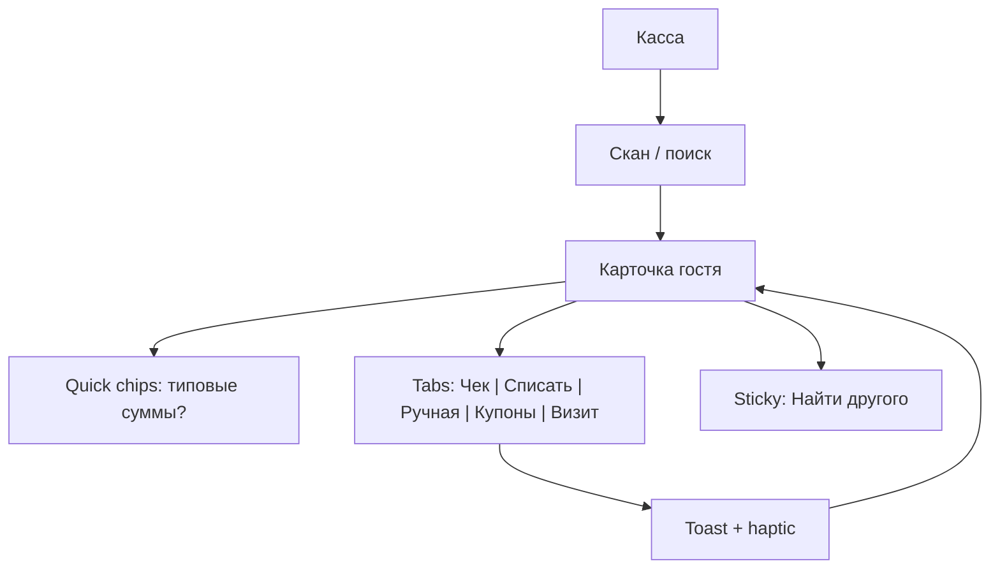

# Друзья — UI/UX: пути, визуал, брендинг (дизайн)

Дата: 2026-08-31  
Статус: согласован с продуктом, ждёт ревью файла  
Продукт: Telegram-бот кальянной «Друзья»  
База: `2026-08-22-friends-loyalty-bot-design.md`, `2026-08-30-friends-v2-expansion-design.md`

## Цель

Улучшить пользовательские пути для всех ролей (гость, мастер, админ), визуал веб-админки, reply/inline UI бота и Mini App (хаб, игры, касса). Добавить управление брендом, сезонными темами и скинами игр из админки. Доменная логика, права и API-контракты бонусов/визитов/игр **не меняются** — только клиентский слой и новые admin/theme/skin эндпоинты.

## Принятые решения

| Вопрос | Решение |
|---|---|
| Hub без визита | **Read-only**: правила, призы, рейтинги, карточки игр; играть — только с визитом |
| Имена в рейтинге | **Не показываем** чужие имена; гость видит **своё место** и **свою строку выделена** |
| Призовые места | **Визуально выделить** топ-N (медали, рамки, подписи призов из `prize_table`) |
| Админ | **Телефон + ПК**; полевые операции в mini app, управление — в веб-админке |
| Админ в боте | Касса + код зала + брони; остальное — **веб-админ** |
| Брендинг | Лого и фото интерьера — **из админки**, не захардкожены |
| Темы / праздники | Админ загружает **сезонные ассеты** (фоны, баннеры, декор) |
| Скины игр | Админ меняет **внешний вид блоков/фишек** (Block Blast — P0, остальные — P1) |
| Block Blast drag | **Баг-fix обязателен** — отдельная спека: `2026-08-31-block-blast-drag-fix-design.md` |

## Вне объёма

- Имена в публичном рейтинге для гостей
- Кастомные шрифты из админки
- Анимированные GIF-темы
- Редактор уровней / правил игр
- Светлая тема как default
- Native app вне Telegram
- Кастомизация бренда per-филиал

---

## 1. Дизайн-система

### 1.1 Единые токены

Один `tokens.css` для mini app и admin:

| Токен | Назначение | Default |
|---|---|---|
| `--bg` | фон страницы | `#1a1210` |
| `--bg-panel` | карточки, панели | `#241a17` |
| `--coal` / `--border` | границы | `#3a2a24` |
| `--smoke` / `--muted` | вторичный текст | `#8a7a72` |
| `--text` | основной текст | `#f3ece6` |
| `--ember` / `--accent` | акцент, CTA | `#d4784a` |
| `--success` | успех, «в зале» | `#68b878` |
| `--danger` | ошибки | `#e07070` |

Display-шрифт для заголовков (напр. Manrope / Golos) + system-ui для body. Радиусы: карточки 12px, кнопки 8px, bottom sheets 16px сверху.

### 1.2 Переиспользуемые компоненты

- **Card** — баланс, гость, игра, KPI
- **Status pill** — «В зале» / «Визит не активен» / «Неделя ДР»
- **Bottom sheet** — правила, рейтинги, check-in (стандартизировать существующий hub sheet)
- **Toast / inline alert** — успех/ошибка операций кассы
- **Empty state** — с CTA («Нет броней», «Рейтинг пуст»)
- **Skeleton** — hub, dashboard, карточка гостя

### 1.3 Telegram-специфика

- Safe area (`--tg-content-safe-area-inset-*`)
- `MainButton` / `BackButton` в mini app на экранах игр и check-in
- Haptic: check-in успех, начисление чека, победа в игре, pickup/drop в Block Blast
- Fallback на `themeParams` Telegram (опционально)

---

## 2. Бренд и темы из админки

### 2.1 Раздел «Бренд / Тема»

Вкладка внутри **Контент и игры → Бренд / Тема** (веб-админ).

**Загружаемые ассеты:**

| Ассет | Где используется | Формат, лимит |
|---|---|---|
| Логотип | welcome бота, header mini app, header admin | PNG/SVG/WebP, ≤2 МБ |
| Фото интерьера (1–5) | hub hero, onboarding, empty states | JPG/WebP, ≤8 МБ |
| Фон hub | mini app игровой хаб | WebP, ≤4 МБ |
| Праздничный баннер | hub hero вместо стандартного | WebP, ≤4 МБ |
| Декор (overlay) | сезонный confetti/sparkle | PNG/WebP, ≤2 МБ |

### 2.2 Модель ThemePack

```ts
type ThemePack = {
  id: string;
  name: string;              // «Новый год», «8 марта»
  activeFrom: string | null; // ISO date, Europe/Moscow
  activeTo: string | null;
  isManualActive: boolean;   // ручное включение поверх дат
  assets: {
    logoUrl?: string;
    interiorUrls?: string[]; // carousel в hero
    hubBackgroundUrl?: string;
    heroBannerUrl?: string;
    decorUrl?: string;
  };
  colors?: {
    accent?: string;  // переопределяет --ember
    bg?: string;      // переопределяет --bg
  };
  updatedAt: string;
};
```

- Одна **активная тема** в момент времени: `isManualActive` или попадание в `[activeFrom, activeTo]`.
- Fallback — дефолтные CSS-токены без кастомных URL.
- Upload: переиспользовать pipeline из `src/domain/menu-gallery.ts` / S3 с prefix `uploads/theme/`.

### 2.3 API

```
GET  /api/theme/active              — публичный, для mini app / бота (без initData)
GET  /api/admin/theme               — список пакетов + активный
POST /api/admin/theme               — создать / обновить пакет
POST /api/admin/theme/:id/upload    — multipart: kind=logo|interior|hubBg|heroBanner|decor
PATCH /api/admin/theme/active       — { packId } | { clear: true }
```

Admin preview: «как видит гость» — мини-превью hub с выбранным пакетом.

### 2.4 Клиенты

| Клиент | Поведение |
|---|---|
| Mini app | fetch `/api/theme/active` при boot hub → CSS variables + background URLs |
| Admin | форма загрузки + preview + date range picker |
| Бот | лого в welcome (URL из API или кэш при старте процесса, TTL 5 мин) |

---

## 3. Скины игр из админки

### 3.1 Модель GameSkin

```ts
type GameSkin = {
  gameSlug: "blockblast" | "match3" | "game2048" | "flappy" | "quiz";
  tiles: Array<{ index: number; imageUrl: string; label?: string }>;
  boardBackgroundUrl?: string;
  trayBackgroundUrl?: string;
  updatedAt: string;
};
```

- Одна активная skin на игру; fallback — emoji/цвета по умолчанию (`TILE_EMOJI` в `block-blast-board.ts`, аналоги в других играх).
- Tile images: 64×64 или 128×128 PNG/WebP.

### 3.2 API

```
GET  /api/games/:slug/skin          — публичный, для mini app
GET  /api/admin/game-skins          — все скины
POST /api/admin/game-skins/:slug    — upsert + upload tiles
DELETE /api/admin/game-skins/:slug  — сброс к дефолту
```

### 3.3 Admin UI

- Превью доски 8×8 (Block Blast) / 8×8 grid (match3) с загруженными тайлами
- Кнопка «Сбросить к дефолту»
- **P0:** Block Blast  
- **P1:** match3, 2048, flappy

### 3.4 Клиент

- Fetch skin при старте игры
- `background-image` на `.bb-block`, `.bb-ghost-cell`, match3 tiles
- Cache bust: `?v=${skin.updatedAt}`

---

## 4. Пользовательские пути

### 4.1 Гость — онбординг



**Улучшения:**

- Inline «Зачем нужен телефон?» до шага контакта
- После регистрации — одно форматированное сообщение-карточка
- Реферальный `/start ref_XXX` — баннер до wizard

### 4.2 Гость — reply-клавиатура

| Ряд | Кнопки |
|---|---|
| 1 | 💰 Баланс · 📱 QR |
| 2 | 🎮 Игры (web_app) |
| 3 | 📋 Меню · 🎁 Акции |
| 4 | 👤 Профиль · 📍 Как доехать · ☎️ Контакты |
| 5 | 📅 Забронировать · 👥 Пригласить друга |
| 6 | ⚙️ Ещё… (inline: история, рассылка, помощь) |

«Ещё…» убирает редкие действия с основной клавиатуры.

### 4.3 Гость — домашний экран (после /start)

Компактная сводка в одном сообщении:

- Баланс + ближайшее истечение лотов (TTL)
- Статус визита (🟢 до HH:MM / ⚪ не в зале)
- Место в общем зачёте недели
- Inline: **Игры** | **QR** | **Забронировать**

### 4.4 Гость — в зале vs дома

| Состояние | Бот | Mini App |
|---|---|---|
| Нет визита | «Отметьтесь в зале» + кнопка Игры | Hub **read-only** + banner check-in |
| Есть визит | «Вы в зале до …» в сводке | Полный хаб + игры |
| Визит закончился | «Спасибо за визит! Очки сохранены до конца недели» | Экран «визит завершён» + рейтинг |

**Целевое число тапов:**

| Сценарий | Цель |
|---|---|
| Показать QR кассиру | 1 тап |
| Забронировать стол | 4 шага с inline-календарём |
| Пригласить друга | карточка + «Поделиться» (t.me/share) |

### 4.5 Мастер

**Reply-клавиатура:**

| Ряд | Кнопки |
|---|---|
| 1 | 🔍 Найти гостя |
| 2 | 📱 Приложение (web_app → касса) |
| 3 | 🏷️ Код зала · 📅 Брони сегодня |
| 4 | 🎮 Игры (просмотр рейтингов) |

Админские кнопки на клавиатуре мастера **отсутствуют**.

**Поиск гостя:**



**Формат карточки гостя (бот):**

```
👤 Иван Петров
📞 +7 *** **67  ·  💰 1 240 бонусов
🟢 В зале до 22:30  ·  🎂 неделя ДР
🎟 Кальян в подарок (активен)
📝 Заметка: любит мяту
```

**Inline actions (2 ряда по смыслу):**

- 💳 Чек · ➖ Списать
- ✏️ Ручная правка · 🕐 Визит
- ⏱ Продлить · ⏹ Закончить (если активен)
- 🎟 Погасить купон

### 4.6 Админ

**Бот — только полевые команды:**

| Ряд | Кнопки |
|---|---|
| 1 | 🔍 Найти гостя · 📱 Приложение |
| 2 | 🏷️ Код зала · 📅 Брони |
| 3 | 🖥 Веб-админ (web_app) |

Убрать из бота: Настройки, Роли, Статистика, Экспорт, Подозрительные партии, Викторина — **только веб**.

Опционально inline «Быстрые действия»: запустить викторину, срочная рассылка.

---

## 5. Mini App — игровой хаб

### 5.1 Hub read-only без визита



**Layout:**

```
┌─────────────────────────────────┐
│ [Banner] Отметьтесь в зале →    │  ← sticky
├─────────────────────────────────┤
│ Hero (тема / countdown / призы) │
│ Ваш зачёт: #12 · 4200 очков     │
├─────────────────────────────────┤
│ Игры (locked overlay + 🔒)      │
│ Правила · Рейтинги              │
└─────────────────────────────────┘
```

- Check-in: **banner + bottom sheet**, не full-screen gate (текущее поведение в `hub.ts` заменяется)
- После успеха: confetti/haptic + banner скрывается + игры разблокируются
- PIN: 4 отдельных поля (OTP-style), автосабмит

### 5.2 Карточка игры

- Обложка (illustration per game или из GameSkin)
- Название + «#3 · 4200 очков»
- Состояния: locked (нет визита) / available / played today
- Tap → detail (топ, мои очки, «Играть»)
- `MainButton` Telegram = «Играть» на экране detail

### 5.3 Game over (все игры)

- Очки сессии
- «+X к недельному рейтингу»
- Место до/после (если изменилось)
- CTA: «Ещё раз» | «К хабу»
- Античит: нейтральное сообщение без технических деталей

---

## 6. Рейтинги

### 6.1 Для гостя

- В списке: `1. 5200 очков`, `2. 4800 очков` — **без имён**
- Строка гостя: `.leaderboard-row--me` — accent border, фон, метка «Вы»
- Вне топа: блок «Ваше место: #47 · 1200 очков» над списком

### 6.2 Призовые места (топ-N)

| Место | Визуал |
|---|---|
| 1 | 🥇 золотая рамка, gradient bg |
| 2 | 🥈 серебро |
| 3 | 🥉 бронза |
| 4–N | accent outline + бейдж «Приз» |

Подпись из `prize_table`: «500 бонусов + Кальян в подарок».

### 6.3 Для персонала

- Имена в рейтинге — **как сейчас** (staff mode в `hub.ts`)
- Privacy гостей не меняется

---

## 7. Mini App — касса (персонал)

### 7.1 Flow



- Accordion/tabs вместо длинной простыни форм (`guest-actions.ts`)
- Успех → toast + haptic, карточка обновляется без full reload
- Код зала: крупные 4 цифры + QR + таймер смены

---

## 8. Веб-админка

### 8.1 IA — 4 раздела

| Раздел | Вкладки |
|---|---|
| **Обзор** | Дашборд, Live зал (код, активные визиты, check-in за час) |
| **Гости** | Список/поиск, карточка, паттерн визитов, сообщение |
| **Операции** | Брони (+ план зала), Персонал (роли, смены), Рассылки |
| **Контент и игры** | Меню, Контент, Настройки, **Бренд/Тема**, **Скины игр**, Игры/призы, Экспорт |

**Навигация:**

| Desktop | Mobile |
|---|---|
| Sidebar слева | Bottom nav (4 иконки) |

Заменить 10 горизонтальных табов (`admin/src/app.ts`).

### 8.2 Mobile-first

- Touch targets ≥ 44px
- Таблицы → карточки на узком экране
- Sticky actions на карточке гостя
- Dashboard: KPI 2×2 grid, график на всю ширину

### 8.3 Дашборд

- KPI-карточки с delta vs прошлый период
- Area chart с hover
- Heatmap с tooltip
- Блок «Сегодня»: pending брони, новые регистрации, топ игроков дня

### 8.4 Карточка гостя

- Timeline: проводки + staff log + игры + брони
- Боковая панель: сообщение гостю

---

## 9. Microcopy

- Tone: дружелюбный («Начислили 200 бонусов за чек 2000 ₽»)
- Ошибки: человеческие + что делать («Недостаточно бонусов. У гостя 340, вы запросили 500»)
- Пустые состояния: с подсказкой следующего шага
- Персонал: глаголы на кнопках («Начислить по чеку», не «Чек»)

---

## 10. Модель данных (новое)

```
ThemePack
  id, name, activeFrom, activeTo, isManualActive
  logoUrl, interiorUrls[], hubBackgroundUrl, heroBannerUrl, decorUrl
  accentColor?, bgColor?, updatedAt

GameSkin
  gameSlug (unique), tileUrls JSON, boardBgUrl?, trayBgUrl?, updatedAt

Setting (existing)
  theme_active_pack_id?  — optional FK или slug
```

Миграция Prisma + сид: дефолтная тема null (fallback tokens).

---

## 11. Метрики успеха

| Метрика | Как мерить |
|---|---|
| Время регистрации | start → contact shared |
| Check-in rate | открыли Игры → успешный check-in |
| Игры за визит | sessions / active visit |
| Время операции кассы | find guest → check applied |
| Admin time-to-insight | login → dashboard loaded |
| Broadcast opt-out | не должен вырасти после UX-изменений |

---

## 12. Фазы поставки

### UI-1 — Critical (1–2 нед.)

- [ ] Block Blast drag fix (отдельная спека)
- [ ] Hub read-only без визита
- [ ] Рейтинг: своё место + highlight призовых
- [ ] Regroup клавиатур бота (гость / мастер / админ)
- [ ] Касса mini app: card + toasts + tabs

### UI-2 — Brand & Admin (2–3 нед.)

- [ ] ThemePack API + админ «Бренд / Тема»
- [ ] Лого + интерьер в hub/onboarding
- [ ] Admin IA (sidebar / bottom nav)
- [ ] GameSkin для Block Blast

### UI-3 — Polish (2 нед.)

- [ ] Onboarding wizard + домашний экран
- [ ] Game covers + game over для всех игр
- [ ] GameSkin для match3 / 2048 / flappy
- [ ] Dashboard charts polish, skeleton, OTP PIN

---

## 13. Затрагиваемые файлы (ориентир)

| Область | Файлы |
|---|---|
| Бот клавиатуры | `src/bot/keyboards.ts`, `guest.ts`, `staff.ts`, `register.ts` |
| Hub | `miniapp/src/hub.ts`, `check-in.ts`, `style.css` |
| Рейтинги | `miniapp/src/hub.ts`, `miniapp/src/style.css` |
| Касса | `miniapp/src/cashier.ts`, `guest-actions.ts` |
| Block Blast | `miniapp/src/block-blast-gestures.ts`, `block-blast-board.ts`, `block-blast.css` |
| Admin | `admin/src/app.ts`, `style.css`, новые модули theme/game-skin |
| API | `src/http/admin.ts`, `src/http/games.ts`, новый `src/http/theme.ts` |
| Storage | `src/domain/menu-gallery.ts` (pattern), `src/storage/object-storage.ts` |
| Domain | новые `src/domain/theme.ts`, `src/domain/game-skin.ts` |

---

## 14. Проверки

**Автотесты:**

- ThemePack: active resolution по датам и manual flag
- GameSkin: fallback при отсутствии skin
- Hub: read-only рендер без visitActive (unit snapshot или DOM test)
- Leaderboard: `.leaderboard-row--me`, prize place classes

**Ручная:**

- Гость без визита: hub read-only, banner → check-in → игры
- Рейтинг: своё место видно, топ-N выделен, имён нет
- Админ: загрузить лого + праздничный баннер → видно в hub
- Block Blast: фигура над пальцем на SE и Pro Max
- Admin mobile + desktop: навигация 4 раздела
